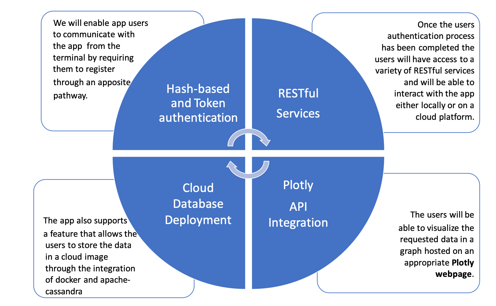

# RESTful App

Useful documentation:
- [docker/docs](https://docs.docker.com/)
- [Cassandra/docs](http://cassandra.apache.org/doc/latest/)
- [Pandas/docs](https://pandas.pydata.org/pandas-docs/stable/)
- [Flask/docs](http://flask.pocoo.org/docs/1.0/)


# 1.  Introduction:
The app is build on 4 main pillars:
1. Hash-based secuirty authentication measures
2. RESTful Services
3. Data Visualization
4. Cloud Database Deployment




## 1.1 Installation 
After cloning the app you need to create a virtual environment in which to operate the app:

```
$ python3 -m venv flask_venv
$ source flask_venv/bin/activate
(flask_venv) $ pip install --upgrade -r requirements.txt
```

1.2 Running
-------

To run the server use the following command:

```
$ python app.py
```

# 2. APP-Documentation:

The following documentation offers a clear explanation of all the functionalities and possible instances that each users will be able to access to:

## 2.1 Registering as a user:

- POST **/api/users**

    Register a new user.<br>
    The body must contain a JSON object that defines `username` and `password` fields.<br>
    On success a status code 201 is returned. The body of the response contains a JSON object with the newly added user.<br>
    On failure status code 400 (bad request) is returned.<br>
    Notes:
    - The password is hashed before it is stored in the database. Once hashed, the original password is discarded.
    - In a production deployment secure HTTP must be used to protect the password in transit.
    
    **Example:<br>**
```
curl -i -X POST -H "Content-Type: application/json" -d '{"username":"TEST","password":"123"}' http://127.0.0.1:8080/api/users
```


- GET **api/all_users_names/<secret_key>**
    
    **This is an admin endpoint. <br>**
    The `secret_key` parameter is stored outside of the  main body of the app and allows only the admin to visualise the active users of the app. <br>
    This requests only allows the admin to viusalise the `usernames`. The admin **does not have** any rights to requested the hashed-password. <br>
    Currently the `secret_key` is stored in the [`instance/users.py`](instance/users.py/) file.<br>
    On success a status code 201 is returned. The body of the response contains a JSON object with the names of all the users who have access to the app .<br>
    On failure status code 400 (bad request) is returned.<br>
    
    **Example:<br>**
```
curl -v http://127.0.0.1:8080/api/all_users_names/<secret_key>
```


- GET **/api/all_users_ids/<secret_key>>**
    
    **This is an admin endpoint. <br>**
    The `secret_key` parameter is stored outside of the  main body of the app and allows only the admin to visualise the active users of the app. <br>
    This requests only allows the admin to viusalise the `userids`. The admin **does not have** any rights to requested the hashed-password. <br>
    Currently the `secret_key` is stored in the `instances/users.py` file.<br>
    On success a status code 201 is returned. The body of the response contains a JSON object with the names of all the users who have access to the app.<br>
    On failure status code 400 (bad request) is returned.<br>

    **Example:<br>**
```
curl -v http://127.0.0.1:8080/api/all_users_ids/<secret_key>
```


- GET **/api/users/<int:id>/<secret_key>**

    **This is an admin endpoint. <br>**
    Return a userid given that the interger is present in the database.<br>
    On success a status code 200 is returned. The body of the response contains a JSON object with the requested user.<br>
    On failure status code 400 (bad request) is returned.
    
    **Example:<br>**
```
curl -v http://127.0.0.1:8080/api/users/<int:id>/<secret_key>
```


- GET **/api/token**

    Return an authentication token.<br>
    This request must be authenticated using a HTTP Basic Authentication header.<br>
    On success a JSON object is returned with a field `token` set to the authentication token for the user and a field `duration` set to the (approximate) number of seconds the token is valid.<br>
    On failure status code 401 (unauthorized) is returned.
    
    **Example:<br>**
```
curl -u TEST:123 -i -X GET http://127.0.0.1:8080/api/token
```
Once the users have succesfully been registered and their details are stored in a database they will be able to access all the functionalities of the app


## 2.2 Using the API' RESTful services:

**WARNING** Before initiating any of these requests you **MUST** be a registered user and the app **MUST** run either on a cloud platform or in your local drive.<br>

**ADVISE** To familiarise with the each of the services and their outputs feel free to try them in the apposite  Jupyter Notebook. Further explanation on the paramters of each function and their output is also contained in the Jupyter Notebook.


- GET **/api/all_crime_data/date/n_records/csv**
    
    This requests has 3 parameters that need to be set when the request is send to the API. <br>
    Initially we will focus only on the first two: 
    - `<date>`; takes in a date (YYYY-MM) as a string format
    - `<n_records>`; allows the user to decide the amount of records that he wants to extract
    - `<csv>`; let's set this to **no_csv** for now.
    
    This request must be authenticated using a previously generated token or by posting a registered username and password.<br>
    On success a JSON object with data for the authenticated user is returned.<br>
    Thanks to the underlying functionalities of the app `pandas` is used to manipulate the format of the initial JSON Object and returned a cleaned up dictionary.<br>
    On failure status code 401 (unauthorized) is returned.<br>
    
    
**Requesting the entire police crime record for the specified date:<br>**
```
curl -u TEST:123 -i -X GET http://127.0.0.1:8080/api/all_crime_data/201811/All/no_csv
```

**Requesting a slice of the police crime record for the specified date:<br>**
```
curl -u TEST:123 -i -X GET http://127.0.0.1:8080/api/all_crime_data/201811/100/no_csv
```
Do not worry about requesting too many records. In the case this happens an appropriate guidance on how to fix the issue will appear.


- GET **/api/code_count/date**
    
    This requests has only 1 parameter `<date>` that takes in a date (YYYY-MM) as a string format.<br>
    This request must be authenticated using a previously generated token or by posting a registered username and password.<br>
    On success a JSON object with data for the authenticated user is returned.<br>
    Thanks to the underlying functionalities of the app `pandas` is used to manipulate the format of the initial JSON Object and returned a cleaned up dictionary.<br>
    **This time the JSON Object is a condesed count of the ["Crime code"] of each Crime for the given date** [see Police API Documentation for more.](https://data.police.uk/docs/method/crime-street/) <br>
    On failure status code 401 (unauthorized) is returned.<br>
    
    
**Requesting the condesed count of the ["Crime Code"]:<br>**
```
curl -u TEST:123 -i -X GET http://127.0.0.1:8080/api/code_count/201811
```


- GET **api/location_count/date**
    
    This requests has only 1 parameter `<date>` that takes in a date (YYYY-MM) as a string format.<br>
    This request must be authenticated using a previously generated token or by posting a registered username and password.<br>
    On success a JSON object with data for the authenticated user is returned.<br>
    Thanks to the underlying functionalities of the app `pandas` is used to manipulate the format of the initial JSON Object and returned a cleaned up dictionary.<br>
    **This time the JSON Object is a condesed count of the ["Sub_location] of each Crime for the given date** [see Police API Documentation for more.](https://data.police.uk/docs/method/crime-street/) <br>
    On failure status code 401 (unauthorized) is returned.<br>
    
    
**Requesting the condesed count of the ["Sub_location]:<br>**
```
curl -u TEST:123 -i -X GET http://127.0.0.1:8080/api/location_count/201811
```


- GET **api/location_count/date**
    
    This requests has only 1 parameter `<date>` that takes in a date (YYYY-MM) as a string format.<br>
    This request must be authenticated using a previously generated token or by posting a registered username and password.<br>
    On success a JSON object with data for the authenticated user is returned.<br>
    Thanks to the underlying functionalities of the app `pandas` is used to manipulate the format of the initial JSON Object and returned a cleaned up dictionary.<br>
    **This time the JSON Object is a condesed count of the ["Crime_Description"] of each crime for the given date** [see Police API Documentation for more.](https://data.police.uk/docs/method/crime-street/) <br>
    On failure status code 401 (unauthorized) is returned.<br>
    
    
**Requesting the condesed count of the ["Crime_Description"]:<br>**
```
curl -u TEST:123 -i -X GET http://127.0.0.1:8080/api/crime_count/201811
```


## 2.3 Using Ploty integration to visualise the data:
This feature of the app allows each user to visualise each of the 3 condesed counts (separetley or together) in an appositley generated webpage hosted by [Plotly](https://plot.ly).

**WARNING** Before initiating any of these requests you **MUST** be a registered user and the app **MUST** run either on a cloud platform or in your local drive.<br>

**ADVISE**:
1. Each graph is currently being plotted on my personal account. It would be wise before running the plotting services app to change the code and insert your personal details. [see Plotly Docs](https://plot.ly). 
2. For security reasons the password of my personal account is not contained in the main body of the app but it is taken from [ `instance/config.py/`](instance/config.py/). The same security implmentation can be done with anothe plotly account.
3. Remember to also change the code in the main [`app.py`](app.py).

The app currently supports 4 different endpoints:

**[Endpoint 1]:**

- GET **/api/code_count/graph/date**
    
    This requests has only 1 parameter `<date>` that takes in a date (YYYY-MM) as a string format.<br>
    This request must be authenticated using a previously generated token or by posting a registered username and password.<br>
    Thanks to the underlying functionalities of the app `pandas` is used to manipulate the format of the initial JSON Object.<br>
    The response automatically sends the user to an appositley generated webpage hosted by Plotly API. <br>
    See an [example](https://plot.ly/organize/kseniyakamen:home#/) of a previously generated graph.
    
    
**Generating a webpage hosted graph for ["Crime Code"]:<br>**
```
curl -u TEST:123 -i -X GET http://127.0.0.1:8080/api/code_count/graph/201811
```

**[Endpoint 2]:**

- GET **/api/location_count/graph/date**
    
    This requests has only 1 parameter `<date>` that takes in a date (YYYY-MM) as a string format.<br>
    This request must be authenticated using a previously generated token or by posting a registered username and password.<br>
    Thanks to the underlying functionalities of the app `pandas` is used to manipulate the format of the initial JSON Object.<br>
    The response automatically sends the user to an appositley generated webpage hosted by Plotly API. <br>
    See an [example](https://plot.ly/organize/kseniyakamen:home#/) of a previously generated graph.


**Generating a webpage hosted graph for ["Sub_Location"]:<br>**
```
curl -u TEST:123 -i -X GET http://127.0.0.1:8080/api/location_count/graph/201811
```

**[Endpoint 3]:**

- GET **/api/crime_count/graph/date** 
    
    This requests has only 1 parameter `<date>` that takes in a date (YYYY-MM) as a string format.<br>
    This request must be authenticated using a previously generated token or by posting a registered username and password.<br>
    Thanks to the underlying functionalities of the app `pandas` is used to manipulate the format of the initial JSON Object.<br>
    The response automatically sends the user to an appositley generated webpage hosted by Plotly API. <br>
    See an [example](https://plot.ly/organize/kseniyakamen:home#/) of a previously generated graph.


**Generating a webpage hosted graph for ["Crime_Description"]:<br>**
```
curl -u TEST:123 -i -X GET http://127.0.0.1:8080/api/crime_count/graph/201811
```

**[Endpoint 4]:**

- GET **/api/all_graphs/date**
    
    This requests has only 1 parameter `<date>` that takes in a date (YYYY-MM) as a string format.<br>
    This request must be authenticated using a previously generated token or by posting a registered username and password.<br>
    Thanks to the underlying functionalities of the app `pandas` is used to manipulate the format of the initial JSON Object.<br>
    The response automatically sends the user to an appositley generated webpage hosted by Plotly API. <br>
    See an [example](https://plot.ly/organize/kseniyakamen:home#/) of a previously generated graph.

**Generating a webpage hosted graph for all 3 [Categories]:<br>**
```
curl -u TEST:123 -i -X GET http://127.0.0.1:8080/api/all_graphs/201811
```

## 2.4 Cloud Database Deployment Apache-Cassandra integration:

**WARNING** 
1. We are currently assuming that you are running your app locally and not on a apposite Cloud Platform. 
2. To run this app locally one **MUST** have [`Docker`](https://docs.docker.com/docker-for-mac/install/) installed
3. The BASH commands may differ for Windows users.

Now that we have a variety of possible datasets that have been extracted thanks the RESTful services of the app we can start deploying the datasets into an apposite Cloud Database. If you recall earlier the **/api/all_crime_data/date/n_records/csv** endpoint had a third parameter `<csv>`. If the users sets the `<csv> = csv` he will be able to locally saved either all the records or a precise number of records for a given date on the same repository.

**Example:<br>**
```
curl -u TEST:123 -i -X GET http://127.0.0.1:8080/api/all_crime_data/201811/100/csv
```
After having locally stored the data we can start our proccess and copy the data on an appositely designed Cloud Database. 


**[First Step]:**
Pulling the Cassandra Docker Image (via the tag latest)
```
docker pull cassandra:latest
```

**[Second Step]:**
Run a Cassandra instance within docker:
```
docker run --name cassandra-test -d cassandra:latest
```

**[Third Step]:**
Check if the instance is running by using:
```
docker ps
```

**[Fourth Step]:**
Copy the csv data extracted with the curl request into the container (100_records_during_2018-11 is the default name set for the csv by the endpoint:
```
docker cp 100_records_during_2018-11 cassandra-test:/home/100_records_during_2018-11
```

**[Fifth Step]:**
Interact directly with the Cassandra instance via its command line shell client ([cqlsh](http://cassandra.apache.org/doc/4.0/tools/cqlsh.html)):
```
docker exec -it cassandra-test cqlsh
```

**[Sixth Step]:**
Inside Cassandra Terminal create a key space for the data to be inserted:
```
CREATE KEYSPACE crime_records WITH REPLICATION =
  {'class' : 'SimpleStrategy', 'replication_factor' : 1};
```

**[Seventh Step]:**
Create a table inside of the keyspace specifying the columns and their dtype:
```
CREATE TABLE crime_records.stats(
codes text,
procedures text,
dates text,
person_ids text,
crime_categories text, 
location_types text,
latitudes text,
longitudes text,
street_ids int,
street_names text,
contexts text,
persistent_ids text,
crime_ids int PRIMARY KEY,
location_subtypes text,
months text);
```

**[Last Step]:**
Copy the data from the csv into the database:
```
COPY crime_records.stats(codes,procedures,dates,person_ids,crime_categories,location_types,latitudes,longitudes,street_ids,street_names,contexts,persistent_ids,crime_ids,location_subtypes,months)
	FROM '/home/100_records_during_2018-11'
	WITH DELIMITER=',' AND HEADER=TRUE;
```

Finally the data can be queried via from the table directly from your Terminal. As an example and to ensure the data was inserted correctly try running this query:
```
select * from crime_records.stats where location_types = 'Force'
   AND procedures = 'Unable to prosecute suspect' ALLOW FILTERING;
```


**[Restart the process.]:**
In the unlikley event that you face an issue with your container try running:
```
docker container ls -all
docker container kill <hash>
docker container rm <hash>
```
By running this code with the apposite hash requirements from your shell you will be able to restart the process from Step 2 onwards.
If on the other hand, you are still experiencing problems try deleting the image and restarting the process from Step 1.
```
docker image ls -a
docker image rm <hash>
```

